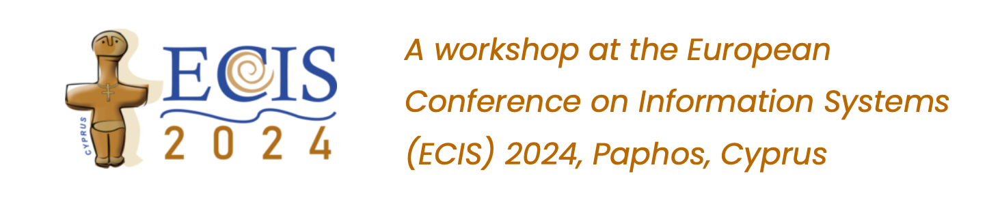

# Three tools to help you navigate and review IS literature: LitBaskets, PermuSearch & CoLRev

This is **Workshop A3** at [ECIS 2024](https://ecis2024.eu/).

Overview: _"As academic literature continues to grow, conducting a literature review can be a daunting, ill-defined, and disorienting process. This workshop focuses on three open source tools, which collectively support the search and review of IS literature. First, with LitBaskets you will learn to easily examine the IS journal literature with varying degrees of scope. Second, with PermuSearch you will learn to automate a search using multiple lists of topics, journals, or years. Third, with CoLRev you will learn to efficiently manage the workflow of screening records, retrieving full-text articles and reporting results as part of a team. Mastery of these three tools will benefit your literature navigation skills in an increasingly growing and complex web of literature. Furthermore, all three of these tools are developed by the IS community, for the IS community: with representation from all three development teams amongst the workshop organisers."_

## Why should I attend this workshop?

- ✨ Learn how to effectively use three innovative tools for literature review "by the IS community, for the IS community".
- 🤗 "Come as you are": there is **no prior submission required**, you can just come with your laptop and with a curious mind.
- 📚 Join the conversation about literature review best practices, approaches, and techniques in general.
- 💬 Participate in the conversation that will inform our future development of these tools.
- 🙏 Opportunities for collaboration: if you are also interested in working towards tools that assist with literature review in IS.

## How can I sign up for the workshop?

TBC

## How can I find out more about the three tools?

Great idea! Whilst the workshop is introductory and you do not need to have used the three tools before, prior interaction will be an advantage. You can find out more as follows:

- LitBaskets: please visit homepage [www.litbaskets.io](https://www.litbaskets.io/). GitHub: [blairw/litbaskets](https://github.com/blairw/litbaskets)
- PermuSearch: please visit homepage [permusearch.com](http://permusearch.com/). GitHub: [spzwanenburg/PermuSearch](https://github.com/spzwanenburg/PermuSearch)
- CoLRev: please visit [colrev.readthedocs.io](https://colrev.readthedocs.io/). GitHub:[CoLRev-Environment/colrev](https://github.com/CoLRev-Environment/colrev)

## What is the outline of the workshop?

- The first 10-15 min. are a brief intro; participants are invited to share prior experiences with IS literature review, in an entry survey.
- The next 45-50 min. are an overview of LitBaskets, delivered by LitBaskets team members (Wang & Boell), who invite participants to try their own searches, and who are on standby to assist with queries.
- The next 45-50 min. are a similar overview and assistance with PermuSearch, supported by the developer of PermuSearch (Zwanenburg).
- Finally, the next 45-50 min. are a similar overview and assistance with CoLRev, supported by CoLRev team members (Wagner & Prester).
- The workshop concludes with a brief summary, reflection and exit survey (~10min).

We will have a break somewhere in the middle. Total run time of the workshop with a break: ~3.5 hrs

## Who are the workshop chairs?

- [Sebastian Boell](https://www.sydney.edu.au/business/about/our-people/academic-staff/sebastian.boell.html), University of Sydney
- [Julian Prester](https://julianprester.com/), University of Sydney
- [Gerit Wagner](https://www.uni-bamberg.de/digital-work/team/prof-dr-gerit-wagner/), University of Bamberg
- [Blair Wang](https://www.blair.wang/), University of Galway (main contact)
- [Sander Zwanenburg](https://www.otago.ac.nz/info-science/about/sander-zwanenburg), University of Otago

Names are listed in alphabetical order by surname; our interest and commitment to the workshop is equal. For queries about LitBaskets please contact Sebastian or Blair. For queries about PermuSearch please contact Sander. For queries about CoLRev please contact Gerit or Julian.

## What do I need to bring to the workshop?

To get the most out of the workshop, we recommend that you bring a laptop that meets the following requirements:

- Working Internet connection and web browser
- Working installation of Microsoft Excel or similar compatible spreadsheet software
- If possible, a working installation of CoLRev
  - You will need a working bash/zsh style command line terminal. On Linux, this is built into the operating system. On Mac, you can use Terminal.app. On Windows, you can use the Windows Subsystem for Linux (WSL).
  - After installing Git (required) and Docker (optional, but recommended), please follow the further instructions at https://colrev.readthedocs.io/

## Submission Link/Site/E-mail:

No submissions prior to the day of the workshop will be necessary. Attendees who would like to come more thoroughly prepared could explore or interact with the tools beforehand using the information provided above. 
😊
